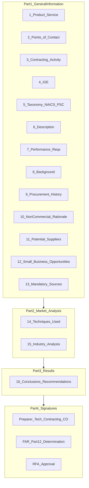

# Government MRR Template Reference — Product Mapping

> **Internal product reference.** Maps the DoD Market Research Report (MRR) Template (MAY 2026) to what Mindy's gov-buyer tool covers today, partially supports, or cannot automate.
>
> **Source PDF:** [`Market Research Report Template (MAY 2026).pdf`](./Market%20Research%20Report%20Template%20(MAY%202026).pdf)
>
> **Related docs:**
> - [`PRD-gov-buyer-market-research.md`](./PRD-gov-buyer-market-research.md) — product spec for the gov-buyer surface
> - [`govcon-market-research.md`](./govcon-market-research.md) — **seller-side** GAO/FAR Part 10 (how contractors respond to government market research)

---

## Executive Summary

The **Market Research Report (MRR)** is an optional DoD template that facilitates collaboration between requiring activities and contracting offices. It streamlines documentation of:

- Government estimates (IGE)
- Commerciality determinations
- Market research results

### When it applies

| Trigger | Detail |
|---------|--------|
| **Threshold** | Actions **exceeding the Simplified Acquisition Threshold (SAT)** or actions that could lead to a **bundled contract** |
| **Contract file** | Once completed, becomes a formal part of the contract file and acquisition planning process |
| **Supports** | Requirements definition, Acquisition Strategy, Acquisition Plan, Source Selection Plan, Small Business Plan |

### Regulatory anchors

| Regulation / policy | Effective / date | Relevance |
|---------------------|------------------|-----------|
| **FAR / DFARS / AFARS RFO** (Revolutionary FAR Overhaul) | **01 February 2026** | Template references implement RFO and DFARS RFO Class Deviations — users must validate all citations |
| **DPCAP memo** — EO 14271 Implementation Guidance | **27 May 2025** | Template can serve as an **individual or class Request for Approval (RFA)** application for non-commercial procurements |
| **AR 25-50** | Current | Authenticatable digital signatures via DoD CAC required; Part 4 Signature Page always required |
| **CUI** | As applicable | Mark each page if requirement involves Controlled Unclassified Information |

### Mindy's scope in one line

**Mindy automates the small-business market-depth slice (§11–12 + partial §14–16), not the full MRR.**

- **Coverage by section count:** ~15–20% of a complete MRR
- **Coverage by CO pain:** the highest-friction small-business determination slice that SBS cannot do (performer-weighted depth vs. raw registration count)

### Live product surfaces

| Surface | Path |
|---------|------|
| Buyer UI | [`/agency`](../src/app/agency/page.tsx) |
| Research API | [`/api/gov-buyer/market-research`](../src/app/api/gov-buyer/market-research/route.ts) |
| Export memo | [`/api/gov-buyer/market-research/export`](../src/app/api/gov-buyer/market-research/export/route.ts) |
| Rubric engine | [`src/lib/gov-buyer/market-research.ts`](../src/lib/gov-buyer/market-research.ts) |

---

## When an MRR Is Required vs Optional

The template is labeled **optional**, but in practice it is the standard vehicle for documenting market research on acquisitions above SAT. Key decision points:

1. **SAT / bundling** — Use for actions above SAT or that could lead to bundled contracts.
2. **RFA path** — When used as a non-commercial RFA application, all **blue-comment** sections must be addressed in detail. RFA approval through this document, an acquisition strategy, or acquisition plan does not need duplication elsewhere.
3. **Tailoring** — Delete red, blue, and italicized instructional language before submission. Sections that do not apply require "Not applicable" with a detailed explanation.
4. **Signatures** — Part 4 is always required (preparer, technical/requirements, contract specialist, contracting officer). Additional approval pages apply for FAR Part 12 disagreements and RFA approvals.

---

## Template Structure Overview

### Part 2 — Market Research Objectives (narrative throughout)

These objectives should be addressed across the document, not in a single section:

- Refinement of the requirement in industry terms or standards
- Increased competition and small business participation
- Understanding of cost; effective contract structure
- Viability of incentive approaches with suppliers
- Insight on cost, schedule, and performance metrics (skill mix, cost avoidance, reduced rework)
- Subcontractor involvement strategy and prime contractor privity
- Early OCI risk identification and mitigation plans
- Intellectual property landscape (tech data, software, government-owned vs. to-be-procured)
- Government-furnished material/equipment/information/real property needs
- Determination of commercial service availability

---

## Mindy Coverage Matrix

| MRR Section | Mindy Coverage | Key Files / Data |
|-------------|----------------|------------------|
| **§1** Product/Equipment/Service/Program | **Manual** | CO-authored requirement title and requiring activity |
| **§2** Points of Contact | **Manual** | Preparer, technical/requirements, contracting POCs |
| **§3** Contracting Activity | **Manual** | Contract specialist and CO identification |
| **§4** Independent Government Estimate | **Partial** (data exists, not MRR-formatted) | USASpending award values elsewhere; no IGE table generation |
| **§5** Taxonomy (NAICS, PSC, size standard) | **Partial** | NAICS filter in search; no PSC/portfolio taxonomy or size-standard lookup in export |
| **§6** Description of Supplies/Services | **Manual** | Requirements-owner narrative |
| **§7** Performance Requirements | **Manual** | Technical/requirements certification |
| **§8** Background | **Manual** | Program history narrative |
| **§9** Procurement History | **Partial** (data exists, not MRR-formatted) | `recompete_opportunities`, USASpending — not wired to MRR export |
| **§10** Non-Commercial Rationale | **Out of scope** | RFA justification — never auto-generate |
| **§11** Potential Supplier Information | **Partial** | `sam_entities` + BQ `recipients`; vendor table in UI and export |
| **§12** Small Business Opportunities | **Partial** | Rule-of-Two count, set-aside filter, tier breakdown |
| **§13** Mandatory Sources | **Out of scope** | FAR Part 8 screening (AbilityOne, FPI, FSS, CHESS) |
| **§14** Market Research Techniques Used | **Partial** | Export cites SAM + USASpending; no technique checklist |
| **§15** Market Intelligence/Industry Analysis | **Partial** | Small business footprint only; no commerciality/pricing/supply chain |
| **§15b** Commerciality Determination | **Out of scope** | Commercial Item Database (EDA/PIEE) — CO-only |
| **§16** Conclusions and Recommendations | **Partial** | Set-aside / Rule-of-Two finding only |
| **Part 4** Signature Pages | **Manual** | CAC digital signatures — never auto-generate |
| **FAR Part 12 Determination** | **Out of scope** | HCA determination when disagreeing with prior commercial item determination |
| **RFA Approval Page** | **Out of scope** | HCA approval for non-commercial procurement |

---

## Section-by-Section Reference

Each block follows: **MRR asks for** → **Regulatory refs** → **Mindy coverage** → **Data source** → **Product implication**.

---

### §1 — Product/Equipment/Service/Program

**MRR asks for:**
- Title or short description of services/supplies required
- Product/equipment/service/program managing office and requiring activity with location
- Example: *"Mission Support Services at Fort Swampy, Louisiana for the United States Army Command."*

**Regulatory refs:** None specific.

**Mindy coverage:** **Manual**

**Data source:** N/A

**Product implication:** Do not auto-populate. Future: optional free-text field on `/agency` for memo header context only.

---

### §2 — Points of Contact

**MRR asks for:**
- Individual preparing the MRR (name, title, email, date prepared)
- Technical/Requirements representative with authority to certify attestations (COR, depot commander, senior program engineer)
- Certification that representatives have specific knowledge of the requirement

**Regulatory refs:** Part 4 signatures must match POC information.

**Mindy coverage:** **Manual**

**Data source:** `user_profiles` (gov_buyer email only in export today)

**Product implication:** Export uses authenticated `.gov`/`.mil` email as "Prepared by." Do not fabricate technical/requirements POCs.

---

### §3 — Contracting Activity

**MRR asks for:**
- Contracting activity and location responsible for the action
- Contract Specialist (name, title, email)
- Contracting Officer (name, title, email)

**Regulatory refs:** None specific.

**Mindy coverage:** **Manual**

**Data source:** N/A

**Product implication:** Out of scope for automation. CO completes before filing.

---

### §4 — Independent Government Estimate (IGE)

**MRR asks for:**
- Estimated value including all options and FAR 52.217-8 (Option to Extend Services)
- Item/quantity/delivery date table with base + options + FAR 52.217-8 periods
- Period of performance for each option
- Estimated unit price and total value per period; overall total
- For **non-commercial**: sufficient narrative on assumptions, tools, information sources, comparison to prior estimates vs. prices paid; detailed attachment
- For **commercial**: commercial sources list documentation in contract file
- Certification that Government independently developed IGE prior to seeking proposals

**Regulatory refs:** FAR 52.217-8; DoD IGE Handbook

**Mindy coverage:** **Partial** (data exists, not MRR-formatted)

**Data source:** USASpending award values (`recipients.total_obligated`, individual awards); not rendered as IGE table

**Product implication:** Mindy can surface **historical award values** as reference data for a CO writing an IGE, but must never present USASpending totals as an IGE. No IGE generation in pilot.

---

### §5 — Taxonomy for This Acquisition

**MRR asks for:**
- Portfolio Group (e.g., "Knowledge-Based Services") — DFARS PGI 237.802-74
- Portfolio (e.g., "Engineering and Technical Services")
- Product Service Code (PSC) and description — [psctool.us](https://psctool.us/)
- NAICS code with **basis for selection** (not merely "same as last procurement")
- NAICS description and corresponding index category
- Small Business size standard — [SBA table](https://www.sba.gov/document/support-table-size-standards)

**Selection guidance:** Principal purpose of the product; industry description; solicitation product description; relative value of components; function of goods. Do not assign wholesale/retail NAICS to supply procurements.

**Regulatory refs:** DFARS PGI 237.802-74; Census NAICS; SBA size standards

**Mindy coverage:** **Partial**

**Data source:** NAICS is the primary search parameter in `runMarketResearch()`; no PSC/portfolio/size-standard fields

**Product implication:** Roadmap: NAICS description + size standard lookup from SBA table when user enters NAICS. PSC suggestion is a separate feature (Mindy seller-side NAICS finder could be reused).

---

### §6 — Description of Supplies/Services

**MRR asks for:**
- Government need description (not contractor deliverables; do not copy PWS/SOW)
- Quantity, period of performance, options, estimated total value
- For RFA: statement that description meets individual/class RFA requirement
- For class RFA: scope, time period, expiration date

**Prompt questions include:**
- Commercial vs. non-commercial? Customary marketplace modifications?
- Components, performance requirements, what the service supports
- When/where required; geographic limitations; delivery requirements
- Unique requirements; distribution needs; mandatory source requirements
- Other agencies buying; available contract vehicles; related requirements

**Regulatory refs:** RFA (DPCAP EO 14271, 27 May 2025)

**Mindy coverage:** **Manual**

**Data source:** N/A

**Product implication:** Out of scope. Requirements owner authors.

---

### §7 — Performance Requirements

**MRR asks for:**
- Critical performance requirements and how they are measured
- If not performance-based: justification for that decision
- Commercial solutions that could address the requirement
- Military-specific requirements if commercial is not feasible
- Requirements/performance trade-offs to align with commercial market
- How industry sells the service/product; whether requirements are written in industry terms

**Regulatory refs:** RFA non-commercial path

**Mindy coverage:** **Manual**

**Data source:** N/A

**Product implication:** Out of scope.

---

### §8 — Background

**MRR asks for:**
- Brief background so approval authority understands the Government's need
- Technical data packages, specifications, engineering descriptions available or to be developed
- Clear descriptions for readers unfamiliar with the supplies/services

**Prompt questions include:**
- New or recurring requirement? How long required and how resourced?
- Prior commerciality determination — when, still viable?
- Relevant prior market research on similar procurements
- Prior acquisition strategies; prior commercial/government work by potential providers
- Barriers to competition removed; prior performance problems
- Past performance baseline; marketplace changes; lessons learned

**Regulatory refs:** RFA non-commercial path

**Mindy coverage:** **Manual**

**Data source:** N/A

**Product implication:** Out of scope. `recompete_opportunities` could inform a CO's background narrative manually.

---

### §9 — Procurement History

**MRR asks for:**
- Table: contract number, contractor, contract type, procurement method, offerors/bidders/vendors, amount, POP
- Narrative subparagraphs per contract: description, procurement method (SBSA, 8(a), unrestricted, sole source), contract type, POP, total amount, option periods (incl. FAR 52.217-8), number of offerors, source selection method, basis for fair/reasonable pricing, commerciality

**Regulatory refs:** FAR 52.217-8; RFA non-commercial path

**Mindy coverage:** **Partial** (data exists, not MRR-formatted)

**Data source:** USASpending/BQ `awards`, `recompete_opportunities`, market scanner incumbent data

**Product implication:** Roadmap (post-pilot): "Procurement history" appendix pulling prior awards for same NAICS/agency. Not in current export.

---

### §10 — Non-Commercial Rationale

**MRR asks for:**
- Rationale for Government-unique, custom-developed, or otherwise non-commercial product/service
- Per DPCAP EO 14271: do not cast truly non-commercial items as "commercial" to misapply Part 12 procedures
- PM and requirements owner must detail justification with CO
- Class RFA: scope, period, expiration date at required detail
- RFA statement: *"This rationale meets the requirement for an individual or class RFA to procure non-commercial products or services."*

**Regulatory refs:** DPCAP memo, 27 May 2025; EO 14271

**Mindy coverage:** **Out of scope**

**Data source:** N/A

**Product implication:** **Never auto-generate.** Mindy is not a commerciality or non-commercial justification tool.

---

### §11 — Potential Supplier Information

**MRR asks for:**
- Vendor table: Name, CAGE, Business Size, Location, Point of Contact (name/phone/email), Capability Assessment (performance, cost, schedule, risk)
- Number of sources contacted; large/small/8(a)/WOSB/government breakdown
- Efforts to locate sources; rationale for excluding sources

**Regulatory refs:** None specific.

**Mindy coverage:** **Partial**

**Data source:**
- `sam_entities` — name, CAGE, state, certifications, registration status
- BQ `recipients` — 5yr `total_obligated`, `award_count`, `distinct_agency_count`, `last_action_date`
- Active Performer rubric tier (`active_performer` | `capable` | `emerging` | `registered_only`)
- Future: `user_boilerplate_docs` cap statements linked by UEI (PRD §6)

**Product implication:** Primary Mindy deliverable. Gaps: POC phone/email, explicit capability narrative, sources-contacted count, exclusion rationale. See [§11 Deep-Dive](#deep-dive-11-potential-supplier-information).

---

### §12 — Small Business Opportunities

**MRR asks for:**
- Assessment of small business set-aside and direct award opportunities
- Specific set-aside type supported by market research results
- FAR Part 19 procedures (WOSB, HUBZone, SDVOSB, 8(a))
- If set-aside not appropriate: supporting rationale for exclusions
- Is service suitable for small business or can requirement be segmented?
- Opportunity for Other Socioeconomic Programs (DFARS Part 226)?

**Regulatory refs:** FAR Part 19; DFARS Part 226

**Mindy coverage:** **Partial**

**Data source:**
- `runMarketResearch()` → `marketDepth`, `ruleOfTwoMet`, `counts` by tier
- Set-aside filter: 8(a), HUBZone, WOSB, SDVOSB, VOSB
- `includeEmerging` toggle (default ON per fairness rule)
- Export memo Rule-of-Two finding

**Product implication:** Primary Mindy wedge. Gaps: narrative rationale for excluding set-aside; FAR 19 sub-part citations. See [§12 Deep-Dive](#deep-dive-12-small-business-opportunities).

---

### §13 — Mandatory Sources

**MRR asks for:**
- FAR Part 8 / DFARS Part 208 sources screened: AbilityOne, Federal Prison Industries, Federal Supply Schedules, Enterprise Software Agreements (incl. CHESS), other preferred sources
- Date and documentation in contract file for AbilityOne/FPI assessments
- POC information for program representatives
- Waiver (purchase exception) if eligible offerings exist but will not receive award

**Regulatory refs:** FAR Part 8; DFARS Part 208

**Mindy coverage:** **Out of scope**

**Data source:** N/A

**Product implication:** Do not build in pilot. CO screens mandatory sources separately.

---

### §14 — Market Research Techniques Used

**MRR asks for:**
- Detailed description of methods used to arrive at findings
- RFA statement when applicable: *"These detailed market research activities meet the requirement for an individual or class RFA..."*

**Example techniques from template:**
- PAM Market Research & Planning page
- Trade journals; knowledgeable people (gov and industry)
- Interviews: COs, contract specialists, SB specialists, project officers, functional experts, DCMA Commercial Item Group
- Market surveys; vendor/customer site visits; trade shows/conferences
- **Government databases:** SAM, FPDS-NG, DoD Service Contract Inventory, civilian agency inventories, GSA Acquisition Gateway
- Web searches (SD-5 Appendix A)
- Prior market research on similar requirements
- RFIs, Sources Sought, draft PWS/SOW/SOO on SAM.gov
- Source lists from other activities, trade associations
- Service provider catalogs and literature
- FSS and IDIQ review (Alliant, SEWP, OASIS, PSS)
- Industry days, pre-solicitation conferences
- Agency/DoD/Federal Category Manager interview

**Regulatory refs:** RFA non-commercial path

**Mindy coverage:** **Partial**

**Data source:** Export methodology section cites SAM entity search + USASpending award analysis only

**Product implication:** Document **only techniques actually run**. Roadmap: "Techniques applied" checklist in export. See [§14 Deep-Dive](#deep-dive-14-market-research-techniques).

---

### §15 — Market Intelligence / Industry Analysis

**MRR asks for:**
- Availability and demand for service/product
- Industry experience level
- Supplier count and market share concentration
- Government market share/leverage
- **Small business footprint**
- Socioeconomic entity participation (8(a), HUBZone, SDVOSB)
- Supply chain structure; pricing structure; market segmentation
- Business/trade/legal/political developments
- Fair/reasonable market price assessment
- Industry standards, regulations, trade journals
- Environmental/safety regulations
- Standard commercial terms and conditions

#### §15a — Environmental Conditions

- Marketplace changes (suppliers, trends, technologies)
- Laws/regulations unique to the item
- Recovered materials and energy-efficient items availability
- Freight and accommodation requirements; standard delivery time

#### §15b — Commerciality Assessment

- Customarily available in commercial marketplace (with/without modifications) vs. government-exclusive
- Revisions Government could make to enable commercial offers
- Prior government market research available
- Customization/tailoring practices and costs
- Customary commercial practices (warranty, financing, discounts, contract type)
- **Commercial Item Database search** (EDA/PIEE) required before determination
- One of four determination statements (prior found and adopted; prior found and disagreed; no prior — commercial; no prior — non-commercial)
- Upload determination to Commercial Item Database within 30 days of award if new commercial determination

#### §15c — Government's Leverage

- Other agencies buying the supply/service
- Current contract vehicles available
- Demand for the service

#### §15d — Pricing Factors and Analysis

- Prices found and sources (catalogs, websites)
- Quantity discounts
- Forces that might drive prices up or down

**Regulatory refs:** DFARS PGI 212.001-70(b); FAR 2.101 (commercial product/service definition); RFA path

**Mindy coverage:** **Partial** (§15 overall); **Out of scope** (§15b commerciality)

**Data source:**
- Partial: tier counts, certification breakdown, performer vs. registration split
- Market scanner / USASpending for agency spending (not in MRR export)
- §15b: no EDA/PIEE integration

**Product implication:** Mindy supports small business footprint slice only. **Never auto-generate commerciality determinations.** See [§15b Deep-Dive](#deep-dive-15b-commerciality-determination).

---

### §16 — Conclusions and Recommendations

**MRR asks for:**
- Acquisition strategies (commercial, 8(a) direct, SB set-aside, sole source, full and open, Native American direct, HUBZone)
- Category Management opportunities
  - Existing contract vehicles
  - Industry best-practice efficiencies
  - Demand management opportunities
- Recommendations on technical document quality and configuration control
- Source selection risks
- Specific contract terms and conditions
- OCI concerns
- Intellectual property considerations
- Government-furnished material/equipment/information/real property

**Regulatory refs:** None specific.

**Mindy coverage:** **Partial**

**Data source:** Export §1 — Rule-of-Two finding only

**Product implication:** Export is a **determination attachment**, not full conclusions. See [§16 Deep-Dive](#deep-dive-16-conclusions-and-recommendations).

---

### Part 4 — Signature Page(s)

**MRR asks for:**
- Separate from document body; always required
- **Prepared by** — matches §2 POC; certifies data accurate and complete
- **Technical/Requirements** — matches §2; same certification
- **Contract Specialist** — certification
- **Contracting Officer** — certification
- Digital signatures with visible date via DoD CAC (AR 25-50)

**Mindy coverage:** **Manual**

**Product implication:** Never auto-sign or auto-certify. Export includes disclaimer that CO remains responsible for final determination.

---

### FAR Part 12 Determination Approval Page

**When used:** CO disagrees with prior commercial item determination in Commercial Item Database; item no longer appropriate for FAR Part 12.

**MRR asks for:**
- HCA determination that prior Part 12 use was improper or no longer appropriate
- Sufficient market research supporting the determination
- Statement that procurement does not meet FAR 2.101 commercial definition
- If non-commercial: individual/class RFA must also be completed

**Regulatory refs:** DFARS 212.001-70(b)(2)(ii)

**Mindy coverage:** **Out of scope**

---

### RFA Approval Page

**When used:** MRR serves as individual or class RFA application for non-commercial procurement.

**MRR asks for:**
- Approval authority assessment within **30 days** of receipt
- Sufficient market research and price analysis for non-commercial procurement
- Class RFA: scope, period, expiration date
- Recommendations to advance commercial solutions where sufficient
- Subject to funds availability and acquisition authorization
- HCA must submit agency RFA data report

**Regulatory refs:** DPCAP memo, 27 May 2025; EO 14271

**Mindy coverage:** **Out of scope**

---

## Product Priority Deep-Dives

### Deep-Dive: §11 Potential Supplier Information

**Template table columns:**

| Column | Mindy today | Gap |
|--------|-------------|-----|
| Vendor Name | ✅ `legalBusinessName` | — |
| CAGE Code | ✅ `cageCode` | — |
| Business Size | ⚠️ Inferred from certifications | No explicit large/SB size from SAM entity data |
| Location | ✅ `state` | City not in export table |
| Point of Contact | ❌ | No name/phone/email |
| Capability Assessment | ⚠️ Tier + score + revenue | No narrative on performance/cost/schedule/risk |

**Mindy also provides (beyond template):**
- Active Performer Score (0–100)
- 5yr federal revenue (`totalObligated`)
- Award count, last action date, agency breadth
- Registration status and expiry

**Roadmap hooks:**
1. Link seller cap statements via `user_boilerplate_docs.uei` (PRD §6) — searchable capability text for Mindy sellers
2. Add SAM POC fields where available in `sam_entities`
3. Add "sources contacted" counter only if Mindy actually contacts sources (don't fabricate)
4. Capability narrative: auto-generate one-line tier explanation per firm, not full CO assessment

---

### Deep-Dive: §12 Small Business Opportunities

**Template requires:**
- Set-aside type **supported by market research** (not just registration count)
- Written rationale if set-aside is **not** appropriate
- Segmentation suitability assessment
- DFARS Part 226 socioeconomic program opportunities

**Mindy delivers today:**

| Output | Source |
|--------|--------|
| `marketDepth` | Active Performer + Capable + Emerging (toggle) |
| `ruleOfTwoMet` | `marketDepth >= 2` |
| Tier breakdown | `counts.active_performer`, `.capable`, `.emerging`, `.registered_only` |
| Set-aside filter | 8(a), HUBZone, WOSB, SDVOSB, VOSB |
| `includeEmerging` toggle | Default ON — fairness rule (PRD §4) |
| Caveats | Verified vs. self-certified certs; data-as-of date |

**Gaps vs. template:**
- No narrative paragraph explaining why a specific set-aside type is recommended
- No rationale for **excluding** a set-aside when Rule of Two is not met
- No FAR Part 19 sub-part citations (e.g., WOSB Program, HUBZone, SDVOSB)
- No requirement segmentation analysis
- No DFARS Part 226 "Other Socioeconomic Programs" assessment

**Roadmap hooks:**
1. Add optional "determination narrative" paragraph to `.docx` export — templated prose CO can edit
2. When `ruleOfTwoMet === false`, suggest narrative boilerplate for full-and-open recommendation
3. When set-aside selected, cite FAR 19.502-2 (Rule of Two) in export footnote

---

### Deep-Dive: §14 Market Research Techniques

**Critical product rule:** Only claim techniques Mindy actually executed.

**Techniques Mindy runs today:**

| Technique | Evidence |
|-----------|----------|
| SAM entity database search | `sam_entities` filtered by NAICS + state + set-aside |
| USASpending award history analysis | BQ `recipients` + `awards` LEFT join by UEI |
| Performance-weighted capability scoring | `scoreEntity()` rubric in `market-research.ts` |

**Techniques Mindy does NOT run (do not claim):**
- Interviews, site visits, industry days, trade shows
- RFIs, Sources Sought, draft PWS review
- FPDS-NG direct query (USASpending is the source, not FPDS)
- Commercial Item Database search
- FSS/IDIQ vehicle review
- Trade journal or catalog review

**Roadmap hooks:**
1. Add export section: **"Techniques Applied"** with checkboxes for SAM search, USASpending analysis, (future) SBS cross-check
2. Add free-text field for CO to document additional techniques they performed manually
3. Never auto-check techniques not run

---

### Deep-Dive: §15b Commerciality Determination

**This section is fully manual — Mindy must never automate it.**

**Template requires:**
1. Search Commercial Item Database at [EDA/PIEE](https://piee.eb.mil/) before any commercial item determination
2. Document search date
3. Include copy of determination in contract file
4. Choose one of four outcomes:
   - (1) Prior determination found — adopt as complete
   - (2) Prior found — CO disagrees; HCA FAR Part 12 determination + RFA required
   - (3) No prior — CO determines commercial per FAR 2.101; upload to database within 30 days of award
   - (4) No prior — CO determines non-commercial; RFA statement required

**Product implication:**
- Do not add "commerciality" fields to `/agency`
- Do not suggest Mindy can replace EDA/PIEE search
- Marketing language: Mindy assists **small business market depth**, not commerciality

---

### Deep-Dive: §16 Conclusions and Recommendations

**Template asks for broad acquisition strategy recommendations. Mindy export today covers one slice:**

| Template asks | Mindy export §1 |
|---------------|-----------------|
| Acquisition strategy (commercial, 8(a), SBSA, sole source, etc.) | Rule-of-Two met/not met → implies set-aside vs. full-and-open |
| Category management / vehicles | ❌ |
| Technical document improvements | ❌ |
| Source selection risks | ❌ |
| Contract terms, OCI, IP, GFM | ❌ |

**Positioning:** The export is titled **"MARKET RESEARCH DETERMINATION — Small Business Market Depth — Set-Aside Analysis"**, not "Market Research Report." It is an **attachment** supporting §11–12 of a full MRR.

**Roadmap hooks (post-pilot, not creep):**
- Suggest acquisition vehicles from forecast/recompete data when incumbent holds expiring contract
- Flag OCI only if we have structured OCI data (we don't today)

---

## Appendix A — Export Memo vs Full MRR

Side-by-side comparison of what [`/api/gov-buyer/market-research/export`](../src/app/api/gov-buyer/market-research/export/route.ts) produces vs. a completed MRR.

| Full MRR Section | In Mindy Export? | Export Section |
|------------------|------------------|----------------|
| §1 Product/Service | ❌ | — |
| §2–3 POCs / Contracting Activity | ⚠️ | "Prepared by" email only |
| §4 IGE | ❌ | — |
| §5 Taxonomy | ⚠️ | NAICS in scope line only |
| §6–10 Description / Performance / Background / History / Non-Commercial | ❌ | — |
| §11 Potential Suppliers | ✅ | §3 business table (top 50) |
| §12 Small Business Opportunities | ✅ | §1 Finding + §2 Tier breakdown |
| §13 Mandatory Sources | ❌ | — |
| §14 Techniques | ⚠️ | §4 Methodology (SAM + USASpending only) |
| §15 Industry Analysis | ⚠️ | Tier counts imply SB footprint only |
| §15b Commerciality | ❌ | — |
| §16 Conclusions | ⚠️ | §1 Rule-of-Two finding only |
| Part 4 Signatures | ❌ | Disclaimer only |
| RFA / FAR Part 12 pages | ❌ | — |

### What the export contains (today)

1. **Header** — "MARKET RESEARCH DETERMINATION / Small Business Market Depth — Set-Aside Analysis"
2. **Metadata** — Date prepared, prepared by, scope (NAICS/state/set-aside), data sources and as-of date
3. **§1 Finding** — Market depth count, Rule of Two met/not met
4. **§2 Market Depth by Capability Tier** — Active Performer, Capable, Emerging, Registered Only counts; Emerging inclusion note
5. **§3 Identified Businesses** — Table: Business, State, Tier, 5yr Federal $, Awards, Certifications (top 50)
6. **§4 Methodology & Caveats** — SAM sync date, verified vs. self-certified certs, USASpending sourcing, tier definitions
7. **Disclaimer** — CO remains responsible for final set-aside decision

### Marketing language guidance

| Say | Don't say |
|-----|-----------|
| "Small Business Market Depth Determination" | "Complete Market Research Report" |
| "Supports §11–12 of your MRR" | "Replaces your MRR" |
| "Performance-weighted Rule of Two analysis" | "Automated market research" |
| "Attachment for your contract file" | "File-ready MRR" |

---

## Appendix B — Acquisition Lifecycle Context

The repo root file [`market research acquisition process.pdf`](../../market%20research%20acquisition%20process.pdf) documents where market research sits in the broader acquisition lifecycle (requirements → market research → acquisition strategy → solicitation). The MRR template is the **documentation vehicle** for the market research phase on acquisitions above SAT. Mindy does not replace the lifecycle — it accelerates one deliverable within it.

---

## Appendix C — Relationship to Seller-Side Market Research

| Audience | Doc | Focus |
|----------|-----|-------|
| **Government buyers (COs)** | This doc + MRR template | What to document before set-aside/acquisition strategy |
| **Contractors (sellers)** | [`govcon-market-research.md`](./govcon-market-research.md) | How to respond to Sources Sought, RFIs, industry days (GAO-15-8) |

When a CO publishes a Sources Sought or RFI (§14 technique), contractors using Mindy's seller tools are participating in the same market research process from the other side. The seller doc and this buyer doc are complementary, not duplicates.

---

## QA Checklist

- [x] All 16 numbered sections represented
- [x] Part 4 signature pages + FAR Part 12 + RFA approval pages represented
- [x] Every section has Mindy coverage rating (Full / Partial / Manual / Out of scope)
- [x] Links to source PDF, PRD, govcon-market-research.md, and live code paths
- [x] Regulatory dates accurate (RFO 01 Feb 2026; DPCAP 27 May 2025)
- [x] Honest positioning: Mindy assists §11–12; CO owns the full MRR

---

*Source: DoD Market Research Report Template (MAY 2026). Internal product mapping — GovCon Giants / Mindy. Last updated: June 2026.*
